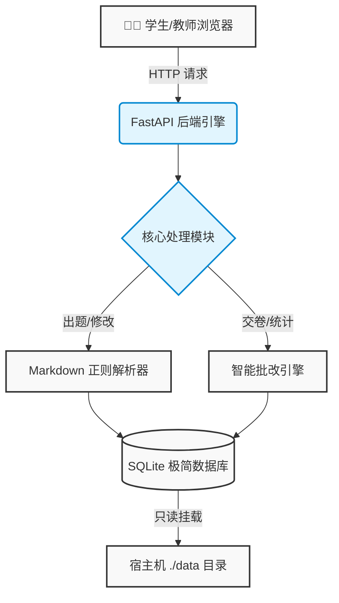

<h1 align="center">智考 Pro (Exam System Pro) V3.1</h1>

<p align="center">
  🚀 专为现代化教学场景打造的轻量级、高性能在线考试与判分系统。基于 Docker 一键部署，Markdown 极速出题，为您带来前所未有的流畅教学体验。
</p>

<p align="center">
  <a href="https://github.com/kzhx666/exam-system-pro/stargazers"></a>
  <a href="https://github.com/kzhx666/exam-system-pro/network/members"></a>
  <a href="https://github.com/kzhx666/exam-system-pro/issues"></a>
  
  
  <a href="https://opensource.org/licenses/MIT"></a>
</p>

---

## 📑 目录 (Table of Contents)

- [✨ 功能特性](#-功能特性-features)
- [📸 界面截图](#-界面截图-screenshots)
- [🖥️ 系统支持](#-系统支持-os-support)
- [🧠 项目架构](#-项目架构-architecture)
- [🚀 快速安装](#-快速安装-installation)
- [✍️ 出题语法](#-出题语法-markdown-syntax)
- [📂 项目结构](#-项目结构-structure)
- [❓ 常见问题](#-常见问题-faq)
- [📈 Star 历史](#-star-历史)

---

## ✨ 功能特性 (Features)

- **📝 Markdown 极速出题**：告别繁琐的表单录入！直接粘贴按特定规则排版的 Markdown 文本（支持图文混排），系统自动解析为交互式试卷。
- **👥 智能名单匹配**：内置 `<datalist>` 模糊搜索，后台预设名单，前台下拉选择，彻底杜绝学生填错姓名，兼容手动输入。
- **⚡ 现代化交互 UI**：采用深色终端风格与 Glassmorphism 设计，高对比度排版，同屏展示 5-7 题，专为大屏和低配移动端深度优化。
- **📊 实时批改与数据看板**：交卷瞬间出分并展示班级排名；教师后台提供直观的答题对错明细，支持随时一键删除无效成绩。
- **🔄 沉浸式解析与无缝重载**：考后生成带解析的独立讲评页；支持后台一键回填编辑，重设分值、修改错题，保存即时生效。

---

## 📸 界面截图 (Screenshots & Demo)

<details>
<summary>点击展开查看系统运行截图 / GIF 演示</summary>

*(提示：此处可替换为您自己项目的真实截图链接)*

**🎓 学生考试终端 (移动端/PC端完美适配)**


**👨‍🏫 教师控制台与数据面板**


**⚡ 一键安装与 Markdown 出题演示 (GIF)**


</details>

---

## 🖥️ 系统支持 (OS Support)

本项目基于 Docker 容器化构建，理论上支持所有主流操作系统及硬件架构。

| 操作系统 (OS) | AMD64 (x86_64) | ARM64 (aarch64) | 备注说明 |
| :--- | :---: | :---: | :--- |
| **Debian** 10/11/12 | ✅ | ✅ | 强烈推荐 |
| **Ubuntu** 18.04/20.04/22.04 | ✅ | ✅ | 推荐 |
| **CentOS** 7/8/9 | ✅ | ✅ | 需提前配好 Docker 源 |
| **Alpine Linux** | ✅ | ✅ | 轻量级极佳 |
| **Windows / macOS** | ✅ | ✅ | 需安装 Docker Desktop |

---

## 🧠 项目架构 (Architecture)



---

## 🚀 快速安装 (Installation)

### 📦 1. 基础环境准备
请确保您的服务器已安装 `git`、`docker` 和 `docker-compose`。

### ⚡ 2. 一键拉取与运行
```bash
# 克隆仓库
git clone https://github.com/kzhx666/exam-system-pro.git
cd exam-system-pro

# 一键构建并后台启动
docker-compose up -d --build
```

### 🎯 3. 访问系统
* 教师管理后台：`http://您的IP:8000/admin`
* **⚠️ 初始安全密码**：`123456`（请在部署后修改 `backend/templates/admin.html` 中的密码逻辑以保证安全）。

---

## ✍️ 出题语法 (Markdown Syntax)

高度优化的正则解析引擎，只需遵循以下格式，其余全交给系统：

```markdown
**1. [单选]** 这里是题干内容（可以换行，可以插图）

A. 选项A的内容
B. 选项B的内容
C. 选项C的内容
D. 选项D的内容
<details><summary>🔎 点击查看答案与解析</summary><blockquote><b>答案：</b>A<br><b>解析：</b>这里写详细的解析内容。</blockquote></details>
```

*(支持 `[单选]`、`[多选]`、`[判断]` 三种题型，判断题选项固定为“正确”与“错误”单列一行。)*

---

## 📂 项目结构 (Structure)

```text
exam-system-pro/
├── backend/
│   ├── main.py              # FastAPI 后端核心引擎
│   └── templates/           # 前端视图 (Vanilla JS)
│       ├── admin.html       # 教师发布与管理中心
│       ├── index.html       # 学生考试终端 V3.1
│       ├── dashboard.html   # 成绩统计大屏
│       └── analysis.html    # 错题讲评解析页面
├── data/                    # SQLite 挂载目录 (.gitignore 保护)
├── docker-compose.yml       # 容器编排文件
└── requirements.txt         # 依赖清单
```

---

## ❓ 常见问题 (FAQ)

<details>
<summary><b>Q1: 如何修改后台管理的登录密码？</b></summary>

在 `backend/templates/admin.html` 文件中，搜索 `123456`，将其替换为您需要的复杂密码，然后执行 `docker-compose restart` 即可。
</details>

<details>
<summary><b>Q2: 为什么题目中的图片在学生端显示不出来？</b></summary>

请确保您 Markdown 中的图片链接是**公网直链**（例如以 `.jpg`、`.png` 结尾，且不需要登录即可访问）。建议使用 GitHub Issues 拖拽上传获取免费图床链接。
</details>

<details>
<summary><b>Q3: 我可以备份或者迁移考试数据吗？</b></summary>

当然可以。所有数据均保存在项目根目录的 `data/exam.db` 文件中。直接拷贝该文件到新服务器的对应目录下，重启容器即可无缝迁移。
</details>

---

## 📦 版本发布 (Release Notes)

- **v3.1.0** (Current): 重构正则引擎，新增多行题干与 Markdown 图片渲染支持；优化交互 UI，支持同屏高密度显示。
- **v3.0.0**: 引入智能名单匹配功能；新增一键编辑重载功能，支持考题热更新。
- **v2.0.0**: 全面升级 FastAPI 架构，抛弃沉重的 MySQL，转用轻量级 SQLite。

---

## 📈 Star 历史

[](https://star-history.com/#kzhx666/exam-system-pro&Date)

---

<p align="center">
  如果这个项目对您的教学工作有帮助，请不要吝啬您的 ⭐️ <b>Star</b>！<br>
  Powered by FastAPI & Docker | MIT License
</p>
